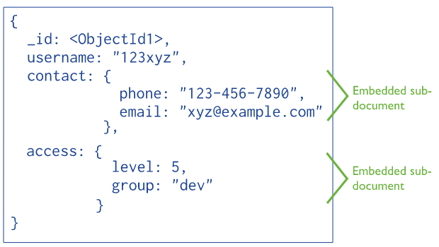
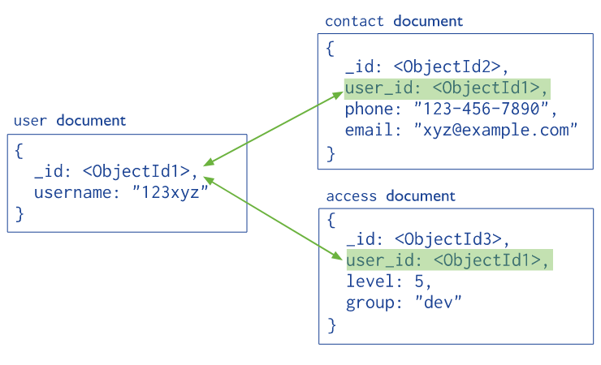

# MongoDB Dasar
Rangkuman belajar dari Channel YouTube Programmer Jaman Now


## Pengenalan Mongo DB

### Pengertian Singkat
- MongoDB merupakan free dan opensource database management system
- MongoDB merupakan database management system berbasis document 
- Dirilis ke public tahun 2009
- MongoDB hampir mendukung semua bahasa pemrograman sebagai client nya
- MongoDB tidak menggunakan SQL, namun menggunakan JavaScript sebagai bahasa utama untuk manipulasi document

### Apa itu Document Oriented Database
- Document oriented database merupakan sistem database yang digunakan untuk memanipulasi data dalam bentuk document (semi structured data)
- Biasanya document disimpan dalam bentuk JSON atau XML
- Document oriented database biasanya bertolak belakang dengan relational database. 

### Relational Database vs Document Database
| Relational DB (sql)   | Document DB (mongodb)         |
| --------------------- | ----------------------------- |
| Database              | Database                      |
| Table                 | Collection                    |
| Column                | Field                         |
| Row/Record            | Document (JSON)               |
| Join Table            | Embedded Document, Reference  |
| SQL Query             | JavaScript Query              |

### Contoh Data di MongoDB
```js
{
   _id: ObjectId(7df78ad8902c)
   title: 'MongoDB Overview', 
   description: 'MongoDB is no sql database',
   by: 'tutorials point',
   url: 'http://www.tutorialspoint.com',
   tags: ['mongodb', 'database', 'NoSQL'],
   likes: 100, 
   comments: [	
      {
         user:'user1',
         message: 'My first comment',
         dateCreated: new Date(2011,1,20,2,15),
         like: 0 
      },
      {
         user:'user2',
         message: 'My second comments',
         dateCreated: new Date(2011,1,25,7,45),
         like: 5
      }
   ]
}
```


## MongoDB Client

### CLI
```bash
mongo --host localhost --port 27017
    or
mongo
```

### MongoDB Compass
DB URI: `mongodb://localhost:27017`


## Database

### Pengertian Singkat
- Database adalah tempat menyimpan collection 
- Biasanya, satu aplikasi akan memiliki satu database
- Jarang sekali kita akan menggunakan satu database untuk beberapa aplikasi

### Membuat Database di MongoDB
- Kita tidak perlu secara eksplisit membuat database
- MongoDB akan secara otomatis membuatkan database sesuai dengan nama database yang kita pilih
- Untuk memilih nama database, kita bisa menggunakan perintah `use <nama_database>`

### Memilih Database
```
> use belajar
switched to db belajar
> show databases
admin   0.000GB
config  0.000GB
local   0.000GB
test    0.000GB
```

> Database `belajar` belum ada karena syarat terbentuknya `database` di mongodb yaitu harus memiliki minimal 1 `collection`

### Database Methods

Methods ini bisa digunakan setelah memilih database dengan `use <nama_database>`

| Database Methods | Keterangan |
| --- | --- |
| `db.dropDatabase()` | Menghapus database |
| `db.getName()` | Mengambil nama database |
| `db.hostInfo()` | Mengambil info host MongoDB |
| `db.version()` | Mengambil versi database |
| `db.stats()` | Mengambil statistik penggunaan database |


## Collection

### Pengertian Singkat

- Collection adalah tempat menyimpan document
- Maximum per document yang bisa disimpan adalah 16MB
- Maximum level nested document yang bisa disimpan adalah 100 level 

### Database Methods untuk Collection

| Database Methods untuk Collection | Keterangan |
| --- | --- |
| `db.getCollectionNames()` | Mengambil semua nama collection |
| `db.createCollection(<collection>)` | Membuat collection baru |
| `db.getCollection(<collection>)` | Mengambil object collection |
| `db.<collection>` | Sama seperti `db.getCollection(<coll>)` |
| `db.getCollectionInfos()` | Mendapat informasi semua collection |
| `db.<collection>.find()` | Mengambil semua document |
| `db.<collection>.drop()` | Menghapus collection |
| `db.<collection>.count()` | Mengambil jumlah document |
| `db.<collection>.totalSize()` | Mengambil total ukuran collection |
| `db.<collection>.stats()` | Mengambil informasi statistik collection |

### Contoh Penggunaan

```js
// Membuat Collection customers
db.createCollection('customers');

// Membuat Collection products
db.createCollection('products');

// Membuat Collection orders
db.createCollection('orders');
```

## Data Model

### Pentingnya Data Modeling
- Pindah dari relational database ke document database bukanlah hal yang sesederhana hanya dengan memindahkan semua table ke collection
- Penggunaan document database tidak akan mendatangkan manfaat besar jika kita tidak mengerti cara memodelkan data untuk kebutuhan aplikasi kita
- Saat memodelkan data menggunakan relational database, biasanya kita mengacu ke database normalization 

### Skema yang Fleksibel di MongoDB
- Di MongoDB kita bisa memasukkan data ke collection secara langsung tanpa mendefinisikan schema collection-nya.
- Schema untuk collection di MongoDB sangat flexible, tiap document bisa berbeda. Tidak seperti table di relational database yang harus sama tiap record.
- Pada prakteknya, **sangat direkomendasikan menggunakan jenis data yang sama** untuk tiap collection, walaupun bisa berbeda-beda di collection yang sama

### Primary Key di MongoDB
- Primary key pada MongoDB yakni field `_id`
- Setiap `document` wajib memiliki `_id`
- Jika tidak disertakan saat insert data, maka akan dibuatkan otomatis dengan tipe data `objectId()`
- Setiap `doucment` hanya bisa memiliki 1 primary key

### Struktur Document - Embedded

- Saat dokumen memiliki ketergantungan tinggi 
- Misal setiap panggil `username` pasti selalu membutuhkan `contact` dan `access`
- Diusahakan memakai `embedded document`, jika terpaksa maka baru `reference document`

### Struktur Document - Reference

- Saat dokumen tidak terlalu memiliki ketergantungan tinggi satu sama lain
- Misal setiap panggil `username`, sangat jarang membutuhkan `contact` dan `access`


## Insert Document

### Syntax
- `db.<collection>.insertOne(document)`
- `db.<collection>.insertMany(array<document>)`
- `db.<collection>.insert(array/document)`

> Lebih baik pakai `insertOne` atau `insertMany` daripada `insert` saja

### Contoh
```js
db.orders.insertOne({
   totalPrice: new NumberLong(8000),
   items: [
      {
         product_id: 1,
         price: new NumberLong(2000),
         quantity: new NumberInt(2)
      },
      {
         product_id: 2,
         price: new NumberLong(4000),
         quantity: new NumberInt(1)
      }
   ]

})
```
> **ingat**: tidak ada `_id`, maka akan otomatis dibuatkan oleh mongodb dengan tipe ObjectId()

```js
db.products.insertMany([
   {
      _id: 1,
      name: "Indomie Goreng",
      price: new NumberLong(2000)
   },
   {
      _id: 2,
      name: "Mie Sedap Goyeng",
      price: new NumberLong(4000)
   }
])
```

## Document Query

`db.<collection>.find(query)`

> **tips**: tambahkan `.pretty()` agar mudah dibaca

`db.<collection>.find(query).pretty()`

### Mengambil data
- _select * from collection_
  `db.<collection>.find()`
- _select * from collection where \_id = 1_
  `db.<collection>.find(_id: 1)`

### Pengenalan Operator


### Comparison Operator


### Logical Operator